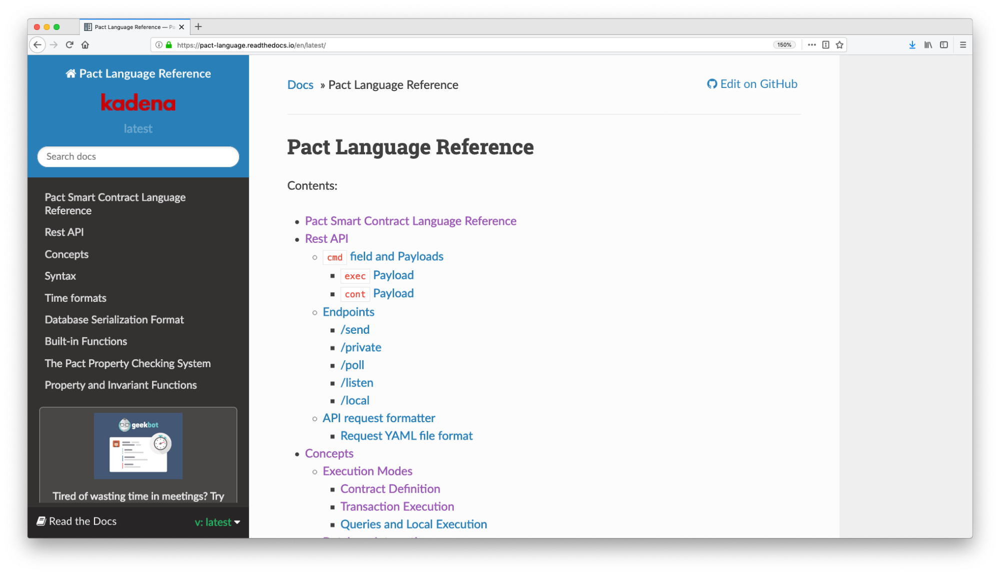
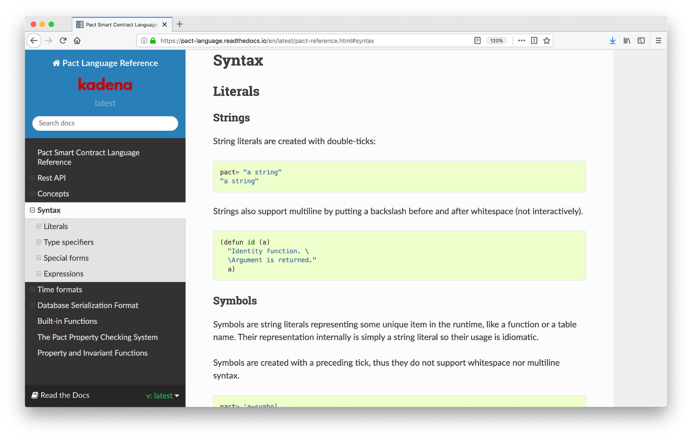
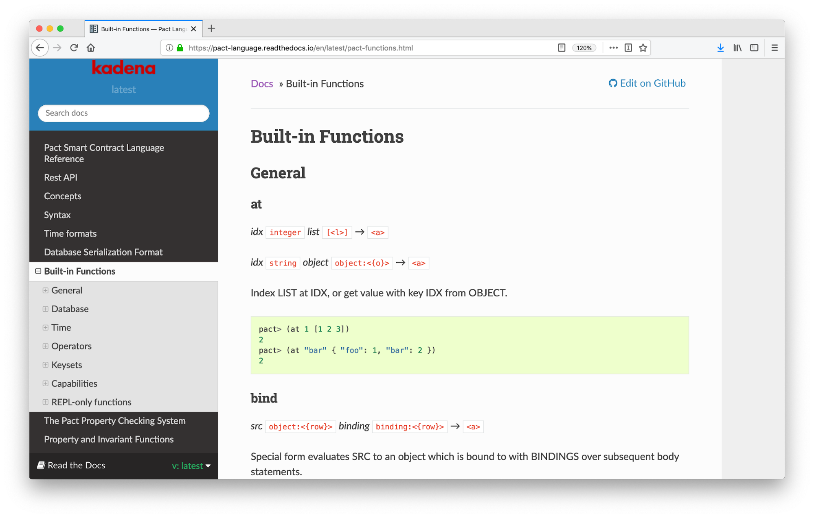

# Pact Language Basics

Welcome to this tutorial on the Pact Language Basics!

In this tutorial you'll learn some fundamental ideas needed started with Pact. You’ll review some of the built-in functions Pact provides, review the language syntax, and write a few functions for yourself.

**Topics covered in this tutorial**

* Pact Language Reference
* Pact Syntax
* Basic Commands
* Built in Functions
* Create Functions

!!! Summary "Key Takeaway"
      The <a href="https://pact-language.readthedocs.io/en/latest/" target="_blank">Pact Language Reference</a> includes an overview of the syntax, basic commands, and built-in functions you’ll use to create smart contracts. By getting familiar with these commands, you’ll be prepared to build simple and safe smart contracts with the Pact programming language.

!!! Tip "Follow Along"
       Open the online editor at <a href="https://pact.kadena.io/" target="_blank">pact.kadena.io</a> to follow along with this tutorial. You can run each of the commands described to get more familiar with the Pact programming language. 
       
       View the <a href="https://pactlang.org/beginner/online-editor/" target="_blank">Pact Online Code Editor Tutorial</a> for more information on running Pact commands.
      

___

## **Pact Language Basics Tutorial**

To get started with the Pact Language Basics, navigate to the <a href="https://pact-language.readthedocs.io/en/latest/" target="_blank">Pact Smart Contract Language reference</a>.

The Pact Smart Contract Language reference describes the syntax and semantics of the Pact language.



If you haven’t already, take some time to review this documentation to better understand the Pact language. 

___

### **Pact Language Syntax**

Start by reviewing the language <a href="https://pact-language.readthedocs.io/en/latest/pact-reference.html#syntax" target="_blank">syntax</a>. Pact syntax can be found using the navigation on the left or by scrolling down to “Syntax” on the home page.



Try running each of the commands on this page in the <a href="https://pact.kadena.io/" target="_blank">Pact Online Editor</a>. Along with those presented in the documentation, this tutorial reviews some of the more common commands you’ll work with when developing smart contracts.

___

### **Basic Commands**

Running basic operations in Pact is simple. Try running each of the commands below in your editor to get more familiar with basic Pact commands.

!!! Note 
      If you are comfortable with data types from other languages, feel free to skip to the built-in functions section. Pact follows conventional standards that are reviewed here to help those get started who may be new to programming.

#### **Integer**

An integer is any whole number value that does not include a decimal.

``` terminal
pact > 19
19
```

#### **Decimals**

Decimals are any values that include a decimal. 

``` terminal
pact > 25.3
25.3
```

#### **Strings**

Try to run the following string. Do you know what is causing the error?

``` terminal
pact > hello
:0:0: Cannot resolve hello
```
**What went wrong?**

The issue is that Pact does not know what hello means. To make it a string, remember to put quotes around it.

``` terminal
pact > "hello"
hello
```
There is also an alternative way to represent strings using Pact.

``` terminal
pact > `hello
hello
```
Preceding strings with a single ` is commonly used to mark unique items such as function or table names. It does not support whitespace or multi-line strings, but can be a helpful way to identify strings more succinctly. 

These are referred to as <a href="https://pact-language.readthedocs.io/en/latest/pact-reference.html#symbols" target="_blank">symbols</a>. 

#### **Boolean**
Booleans include true and false.

``` terminal
pact > true
true
```

#### **List**
Pact allows you to express lists using brackets.

``` terminal
pact > ["Alice" "Dinesh" "Lee"]
["Alice" "Dinesh" "Lee"]
```

#### **Objects**
Pact also has objects that closely resemble Javascript objects. Objects are key-value as shown below.

``` terminal
pact > { "type": "cat", "name": "Scratchy", "age": 6 }
{"type": "cat"
  , "name": "Scratchy"
  , "age": 6}
```

This object describes a pet cat named Scratchy who’s 6 years old. 

#### **Make a List of Objects**
Pact also allows you to make a list of objects. 

``` terminal
pact > [
  { "type": "cat", "name": "Scratchy", "age": 6 }
  { "type": "dog", "name": "Fluffy", "age": 3 }
  ]

[{"type": "cat"
  , "name": "Scratchy"
  , "age": 6} 
 {"type": "dog"
  , "name": "Fluffy"
  , "age": 3}]
```

The list above includes a cat named Scratchy, a dog named Fluffy, and gives them both an age value.

#### **Time**
Time has many different properties and is supported by Pact. Look through the following example along with the supporting summary of time formats to better understand one possibility of representing time with Pact.

``` terminal
pact> (format-time "%Y-%m-%dT%H:%M:%S%N" (time "2016-07-23T13:30:45Z"))
"2016-07-23T13:30:45+00:00"
```

The following table provides a summary of time formats in the order of the example shown above.

| format | purpose                                                                                                                                                   |
|--------|-----------------------------------------------------------------------------------------------------------------------------------------------------------|
| %Y     | year, no padding.                                                                                                                                         |
| %m     | month of year, 0-padded to two chars, "01"–"12"                                                                                                           |
| %d     | day of month, 0-padded to two chars, "01"–"31"                                                                                                            |
| T      | Text character placed in formatting to separate date from time. This is meant to help make this differentiation but is not part of an actual time format. |
| %H     | hour of day (24-hour), 0-padded to two chars, "00"–"23"                                                                                                   |
| %M     | minute of hour, 0-padded to two chars, "00"–"59"                                                                                                          |
| %S     | second of minute (without decimal part), 0-padded to two chars, "00"–"60"                                                                                 |
| %N     | ISO 8601 style numeric time zone (e.g., "-06:00" or "+01:00") /EXTENSION/                                                                                 |

View the language reference for more <a href="https://pact-language.readthedocs.io/en/latest/pact-reference.html#time-formats" target="_blank">time formats</a>.

#### **Parenthesis**
When working more sophisticated programs in Pact, you’ll quickly notice the heavy use of parentheses. This syntax comes from Pacts LISP like syntax and is common in all LISP like languages.

Below is an example helloWorld module in Pact. Notice the use of parentheses to mark each statement including modules, functions, and logic.

``` clojure
(module helloWorld 'admin-keyset
  (defun hello (name)
    (format "Hello {}!" [name]))
)
```

#### **Comments**
Comments are creating using `" "` or `' '` to clearly describe the purpose of the code.

Here is the same **helloWorld** smart contract with comments included in the module.

``` clojure
(module helloWorld 'admin-keyset
  "A smart contract to greet the world."
  (defun hello (name)
    "Do the hello-world dance"
    (format "Hello {}!" [name]))
)
```
___

## **Built-in Functions**

After getting familiar with the Pact language syntax, you are ready to start working with some of Pacts built-in functions. To access the Pact <a href="https://pact-language.readthedocs.io/en/latest/pact-functions.html" target="_blank">built-in functions</a>, navigate to **Built-in Functions** using the navigation on the left.



As you’ll see, there are many functions organized into a few key categories. 

**Pact Standard Library Built-in Function Categories**

* General
* Database
* Time
* Operators
* Keysets
* Capabilities
* REPL-only functions

While many of these are valuable to learn, this tutorial will focus on only a few of them to get you started. Many other functions will come up in later tutorials as they become relevant to the programs you create.

___

### **Arithmetic Operators**

Some of the simplest built in functions are the arithmetic operations. In Pact you can also add, subtract, multiply, or divide by changing the operator.

!!! Note
      Pact uses prefix notation for math operators. This is common in LISP like languages like Pact. Prefix notation means that the operator precedes the 2 values it’s performing the operation on. 

#### **Add 2 Numbers**
For example, by typing the following operation into your terminal should return 25.

``` terminal
pact> (* 5 5)
25
```
Other math operations can be performed by changing <a href="https://pact-language.readthedocs.io/en/latest/pact-functions.html#star" target="_blank">multiply</a> to <a href="https://pact-language.readthedocs.io/en/latest/pact-functions.html#plus" target="_blank">add</a>, <a href="https://pact-language.readthedocs.io/en/latest/pact-functions.html#minus" target="_blank">subtract</a>, or <a href="https://pact-language.readthedocs.io/en/latest/pact-functions.html#id10" target="_blank">divide</a>.

#### **Combine Expressions**
Pact’s simple expression syntax makes it easy to build more complicated expressions by nesting parentheses.

Have a look at the expression below followed by its Pact equivalent. Can you tell how this expression is evaluated?


``` terminal
;; Example: 5 + 2 - 4 = 3
;; Pact > ( + 5 ( - 2 4 ) )  = 3
```
In this case, Pact evaluates 2 - 4, to get -2, then evaluates -2 + 5 to get the final answer of 3. 

___

### **Comparison Operators**

Another group of helpful operators is the comparison operators. These check whether values are equal, not equal, greater than, less than, and includes other common comparisons.

**Here’s a table showing each of the comparison operators available in Pact.**

Along with arithmetic operators and comparison operators, Pact supports boolean, exponential, rounding, and many other common operators. You can learn more about each of these in the operator documentation. 

|    |                             |                               |
|----|-----------------------------|-------------------------------|
| != | True if X does not equal Y. | (!= "hello" "goodbye") = true |
| <  | True if X < Y.              | (< 1 3) = true                |
| <= | True if X <= Y.             | (<= 5.24 2.52) = false        |
| =  | True if X equals Y.         | (= [1 2 3] [1 2 3]) = true    |
| >  | True if X > Y.              | (> 1 3) = false               |
| >= | True if X >= Y.             | (>= 1 3) = false              |

Along with arithmetic operators and comparison operators, Pact supports boolean, exponential, rounding, and many other common operators. You can learn more about each of these in the <a href="https://pact-language.readthedocs.io/en/latest/pact-functions.html#operators" target="_blank">operator documentation</a>. 

___

### **General Built-in Functions**

General functions are responsible for common tasks like manipulating lists, assigning values, checking values, and have many other use cases. 

### **At**
The first function listed on this page is <a href="https://pact-language.readthedocs.io/en/latest/pact-functions.html?highlight=at#at" target="_blank">at</a>
. 

To run the **at** function, type the following command into your terminal and hit enter. 

``` terminal
pact > (at 1 [1 2 3])
2
```
As you can see, I get a result of 2, which is the 1st index of this list.

You can also search for other values by changing the index. Try updating this to look at index 2 and you should get back a 3.

#### **Get a Value from an Object**
You can also use **At** to get the value from an object. By specifying the object key, you can return the value of that key from the object.

``` terminal
pact > (at "name" { "type": "cat", "name": "Scratchy", "age": 6 })
Scratchy
```

### **Bind**
<a href="https://pact-language.readthedocs.io/en/latest/pact-functions.html?highlight=at#bind" target="_blank">**Bind**</a> allows you to map a variable to a value from within an object.  

``` terminal
(bind { source-object } {object-value := variable} variable)
```
To create a binding, use the keyword **bind** followed by a source object. Follow this object with another object containing a specific value within the source using the := symbol. 

``` terminal
pact > (bind { "a": 1, "b": 2 } { "a" := a-value } a-value)
1
```

**Example**

Bindings are valuable when you want to bind the values of a table to a variable. Here is a brief example showing how they can be used within a function.

``` clojure
(defun pay (from to)
    (with-read payments from { "balance":= from-bal }
    ...code
)
```
This example reads a table named **payments** that includes a user **from** that is sending a balance. A binding is used in this case to map the **balance**, which is a column in the table, to the value of **from-bal** that is provided by the user.

This allows you to call the balance of the user using the variable **balance** rather than the variable **from-bal**. 


### **Map**
<a href="https://pact-language.readthedocs.io/en/latest/pact-functions.html?highlight=at#map" target="_blank">Map</a> allows you to apply a specific operation to all elements within a list and return the results.

To create a mapping, use the keyword **map** followed by the operation and the list.

``` terminal
pact > (map (+ 1) [1 2 3])
[2 3 4]
```
After running this command, a new list is returned with the value 1 added to each element within the original list.

You can also use this operation to map other values, including strings. For example, if you have a list of names, you can map “Hello ” to each of them to returning a friendly message for each list item. 


``` terminal
pact> (map (+ "Hello ") ["Kadena" "Pact" "Standard Library"])
["Hello Kadena" "Hello Pact" "Hello Standard Library"]
```

After running this command, a new list is returned with the value “Hello ” added to each element within the original list.

!!! Note
      You can use any of the operators available in Pact when creating a mapping.


### **Format**

<a href="https://pact-language.readthedocs.io/en/latest/pact-functions.html?highlight=format#format" target="_blank">**Format**</a> allows you to piece messages together using a mix of strings and variables. Formatting is great to use any time you need to send messages to your users.

To get started with the format function, paste the example from the documentation into your terminal. When you run this, you’ll see that what you get back is a string that inserts the variables provided in the postfix into the original string where the brackets are located.  

``` clojure
(format "My {} has {}" ["dog" "fleas"])
"My dog has fleas"
```

You can now place whatever values you’d like into this string. 

The first set of curly brackets corresponds to the first value in the list, the 2nd corresponds to the 2nd, and so on for as many values as exist.

___


## **Prepare to Write Functions**

Coming up, you’ll create a few functions for yourself. You can do this in the <a href="https://pact.kadena.io/" target="_blank">Pact Online Editor</a> to get some practice creating and running functions.

Before creating your functions, take a moment to create a keyset and module. 

``` clojure
(define-keyset 'admin-keyset (read-keyset "admin-keyset"))

(module myModule 'admin-keyset
       ;; DEFINE FUNCTION HERE
)
```

Writing your functions within the module will allow you to run the programs you create.

___

## **Create a Function**

While many built-in functions are provided for you with the Pact Standard Library, you’ll often create your own functions. 

Here is the syntax used to create a function in Pact. 

``` clojure
(defun returnPhrase (a b)
    ;; COMMANDS GO HERE
)
```

In this example, a function named returnPhrase will accept inputs a and b.

## **Format a String**

For your first function, try creating a phrase using the built-in **format** function from earlier. 

``` clojure
(format "My {} has {}" ["dog" "fleas"])
"My dog has fleas"
```

By creating a function, you can take any two inputs from a user and return a formatted string value. 

``` clojure
(define-keyset 'admin-keyset (read-keyset "admin-keyset"))

(module myModule 'admin-keyset
    (defun returnPhrase (a b)
        (format "My {} has {}" [a b])
        )
)

(returnPhrase "dog" "fleas")
```

Select **Load into REPL** to see the output.

You can now change these inputs to any values you’d like. I’ll try “cat” and “claws”. 

``` clojure
(define-keyset 'admin-keyset (read-keyset "admin-keyset"))

(module myModule 'admin-keyset
    (defun returnPhrase (a b)
        (format "My {} has {}" [a b])
        )
)

(returnPhrase "cat" "claws")
```

Select **Load into REPL** to see the new phrase.

___

### **Add 2 Numbers**

Before wrapping up, try creating a function using one of the math operations from earlier.

Here is the command used to add two numbers.

``` terminal
pact > (+ 5 5)
10
```

Try creating a function that takes any two numbers as input, adds them together, and returns their sum.

``` clojure
(define-keyset 'admin-keyset (read-keyset "admin-keyset"))

;; Define the module.
(module myModule 'admin-keyset
    (defun addNumbers (a b)
        (+ a b)
        )
)

;; Call the function
(addNumbers 12 7)
```
You can now provide any two values to add with this function. 

___

## **Review**

That wraps up this introduction to the Pact Standard Library.

Throughout this tutorial, we introduced the basics of the Pact programming language. You went over the Pact Standard Library, basic syntax, commands, and built-in functions. You also wrote a few functions for yourself.

If you’re familiar with other programming languages, a lot of these ideas should be familiar. The goal here was to make sure you know where to find helpful resources and are prepared to start writing smart contracts for yourself.

If you’re new to programming, this tutorial hopefully helped you better understand some of the fundamental concepts of programming. You're now ready to try some new ideas for yourself.

Take some time to explore the documentation and try a few more of the Pact built-in functions. Smart contracts you create will depend on you being familiar with these basic ideas. You'll see plenty more examples of these concepts throughout the upcoming tutorials.


