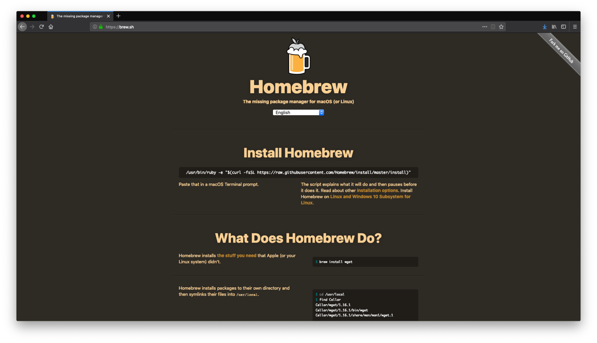
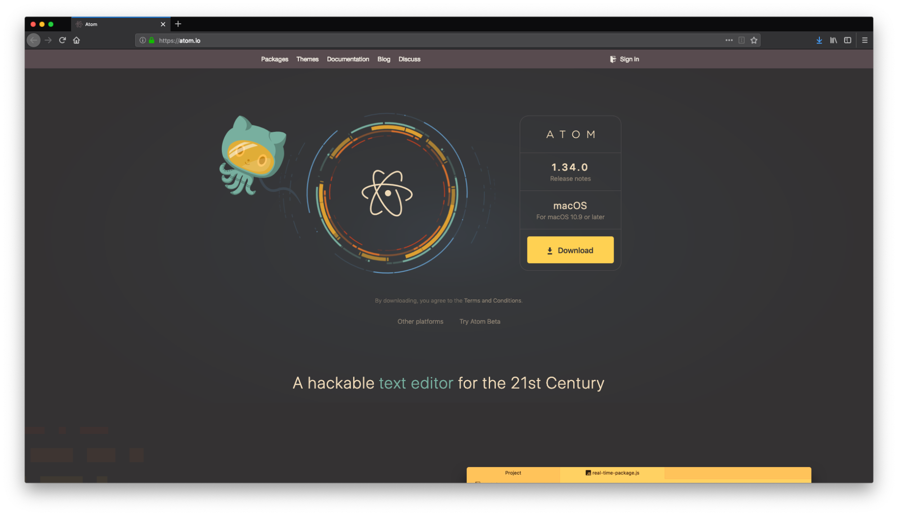
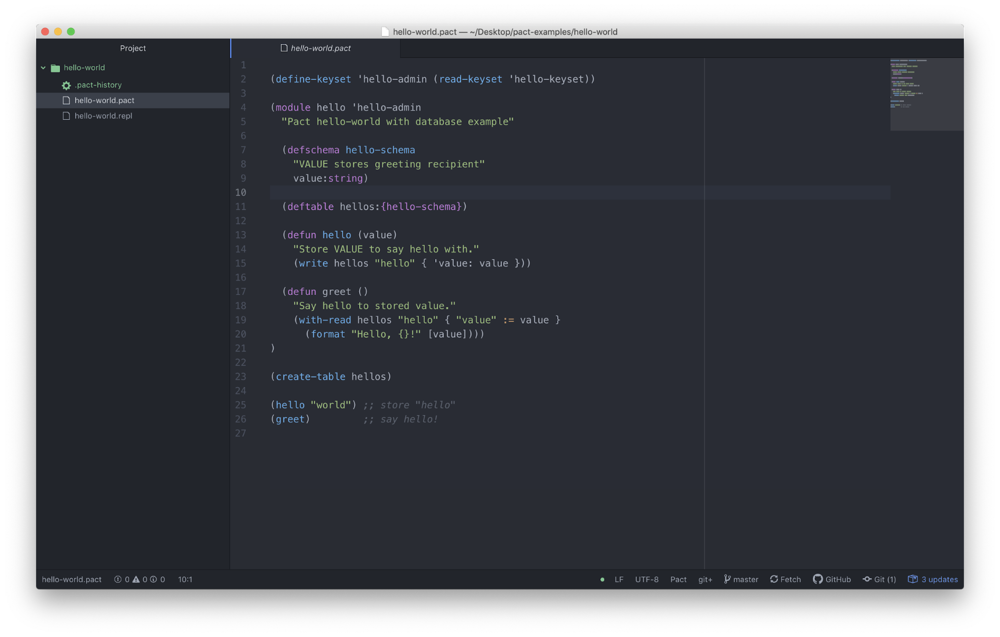

# Pact Development on Atom SDK

This tutorial will get you up and running with the Pact programming language on the Atom SDK.

**Topics covered in this tutorial**

* Pact in your Local Environment
* Install Homebrew
* Install the Pact Programming Language
* Install Atom
* Install the Atom language-pact package
* Run Code Locally


The goal of this tutorial is to get you up and running with the Pact environment and the Pact Atom SDK to begin running Pact programs locally.

!!! Summary "Key Takeaway"
      Pact and the Atom SDK provide a powerful development environment that allows you to run Pact programs locally.

___

## **Pact Development on Atom SDK Tutorial**

Getting started with Pact on your local device allows you to work in a powerful development environment to run your smart contracts locally. This environment can be set up on Mac, Windows, and Linux operating systems.

This tutorial will go over the details of getting up and running on a Mac operating system.

!!! Warning "Windows and Linux Users"
      More instructions on installing Pact with **Windows** or **Linux** can be found on the <a href="https://github.com/kadena-io/pact" target="_blank">GitHub</a> page.

<iframe width="720" height="405" src="https://www.youtube.com/embed/J-GuviTE3qo" frameborder="0" allow="accelerometer; autoplay; encrypted-media; gyroscope; picture-in-picture" allowfullscreen></iframe>

### **Install Pact**

To get started with Pact you’ll first need to install the Pact programming language.

The easiest way to do this is by using Homebrew for Mac. If you have Homebrew, run the following line in your terminal.

``` terminal
brew install kadena-io/pact/pact
```

This will install Pact on your computer.

### **Homebrew**

If you don’t have Homebrew, you’ll need to get that first. To find instructions for this go to <a href="https://brew.sh/" target="_blank">brew.sh</a>. 

This is a popular package manager used to install many packages for Mac. If you’re just getting started with it I’m sure you’ll also find it valuable in the future. 



To install Homebrew, copy the command provided on the center of the screen and run it in your terminal window.


After a few moments you’ll have Homebrew installed on your computer. To verify your installation type `brew --version`.

This should return the current version of your installation.

### **Pact Programming Langauge**

Now that you have Homebrew, you can use it to install the Pact language. As I mentioned earlier, you’ll do this with the following command.

``` terminal
brew install kadena-io/pact/pact
```

To check the installation go to your terminal and type Pact.

This should open up the Pact environment. You can run any commands available in Pact from this environment. 

For example, typing ( + 1 2 ) will add these 2 numbers and return a value of 3. 


You can find other commands in the documentation and we’ll go over many of these throughout other tutorials.

___

### **Atom SDK**

The terminal is helpful, but you’ll often want to create larger programs from within your editor. 

The best way to write smart contracts locally is by using the Atom editor. Pact provides Atom integration giving you syntax highlighting, continuous integration with a directory, .repl scripts, and errors/warnings linting.

To install the Atom editor, navigate to <a href="https://atom.io/" target="_blank">atom.io</a>
 and select **download**. 

From there, follow the installation instructions to get up and running with Atom.  



___

### **Language-pact Package**

To install the language-pact package, open **Atom**, go to Atom in the menu and select **preferences**. From within preferences select **packages** and type **language-pact**. 

Once you do this you should see the package appear. Click **install** to install this package.

At this point Atom is set up to run the Pact programming language. 

___

### **Language-pact Package**

To install the language-pact package, open Atom, go to Atom in the menu and select preferences. From within preferences select packages and type language-pact. 

Once you do this you should see the package appear. Click install to install this package.

At this point Atom is set up to run the Pact programming language. 

___

### **Hello World from your Local Environment**

Before wrapping up, try running your first Hello World smart contract in Atom. 

To do this, open your terminal and navigate into whichever folder you would like as a project directory.

``` terminal
cd Desktop
```

Next, clone the pact examples GitHub repository found <a href="https://github.com/kadena-io/pact-examples" target="_blank">here</a>.

``` terminal
git clone https://github.com/kadena-io/pact-examples
```

This clones a directory with many Pact examples. For now, navigate to the Hello World example.

``` terminal
cd pact-examples/hello-world
```

From within this folder, open the Pact terminal.

``` terminal
pact
pact>
```

Using the Pact terminal, run the **hello-world.repl** file.

``` terminal
(load "hello-world.repl")
```
!!! Note 
      The .repl file loads the smart contract from the .pact file to run the code. This file contains the code behind the **Load into REPL** feature that has so far been available automatically from the online editor allowing you to run code locally. The contents of this .repl file are explained in more detail in the next tutorial. 

After running this file, you should see the following output to your terminal.

``` terminal
"Loading hello-world.repl..."
"Setting transaction data"
"Setting transaction keys"
""
""
"Loading hello-world.pact..."
"Keyset defined"
"Loaded module \"hello\", hash \"a493bb7d096c786891bde5d2125c5acbdcd769ba68c50d38691d173b3b7c03ee85cfcde2db34afb0c6c20c5cde3433ab129829ae4283ed789bd7a9d40837fe88\""
"TableCreated"
"Write succeeded"
"Hello, world!"
""
""
"Hello, world!"
```

Receiving this message means that you have run the code correctly!

You can check the contents of this smart contract by opening it in Atom. 

First, exit the Pact terminal (or open a new terminal in this directory)

* Press **Control + D** to exit the Pact terminal.
* Enter **atom .** to open the directory in Atom.

Look through the code provided to better understand the contents of this smart contract. 



It is slightly different than the hello world smart contract you had seen previously in the online editor. As you’ll see, it stores the value in a table and then returns that value using some of the Pact built-in functions you learned in previous tutorials. 

___

## **Review**

That wraps up this tutorial. The goal of this tutorial was to get you up and running with Pact on the Atom SDK. 

In this tutorial, you got started with Pact locally. You installed Homebrew, Atom, the language-pact package, and the Pact language. You also ran your first hello-world Pact program on your local computer. 

Depending on your needs, you can now use both the online editor and the Atom editor to create Pact programs. 


