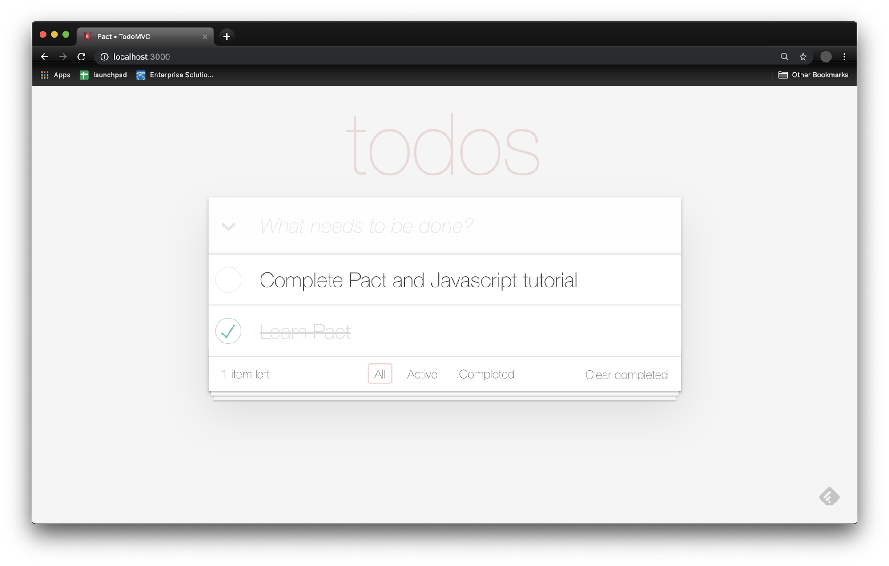
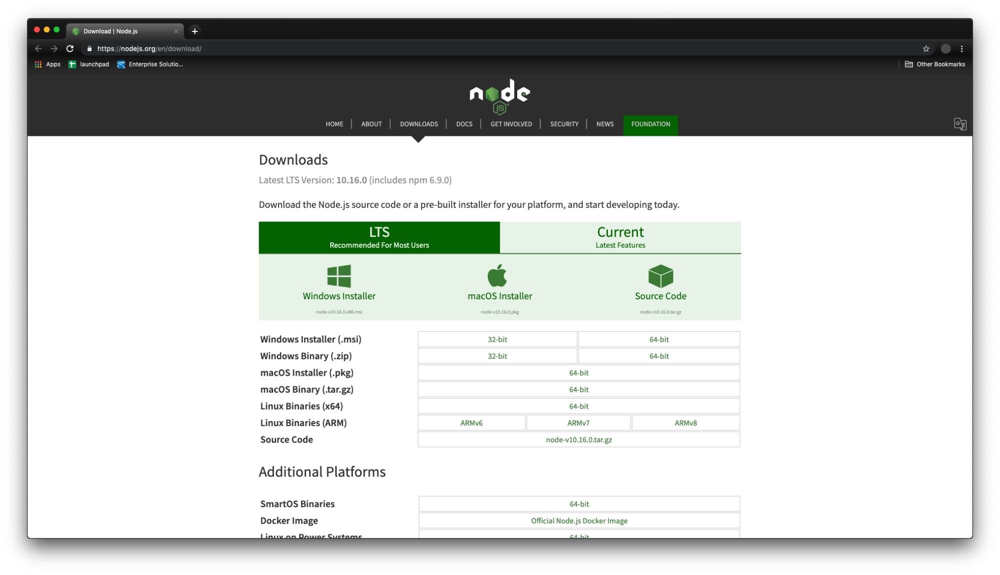
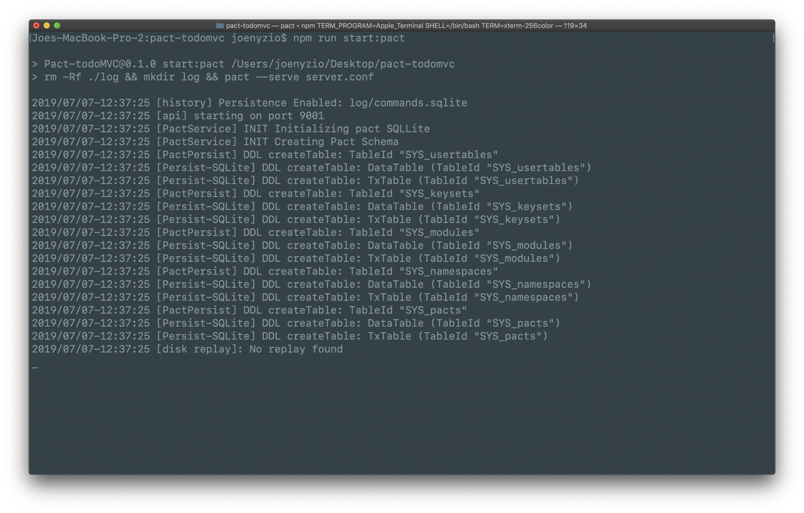
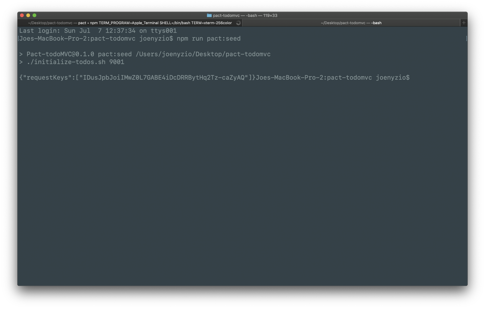
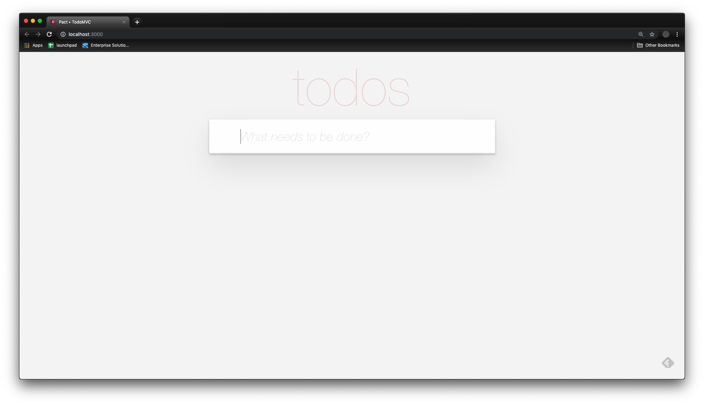
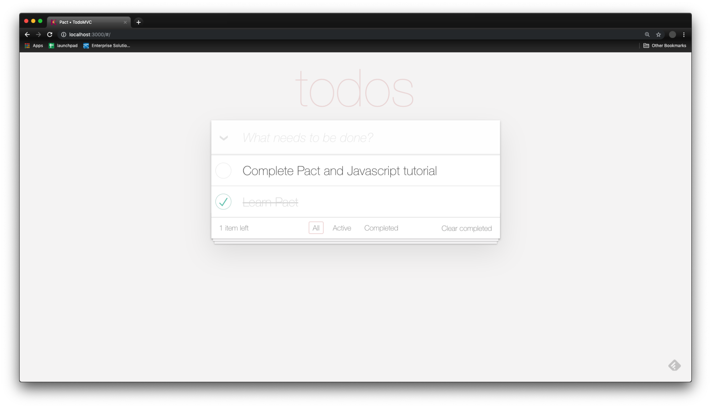
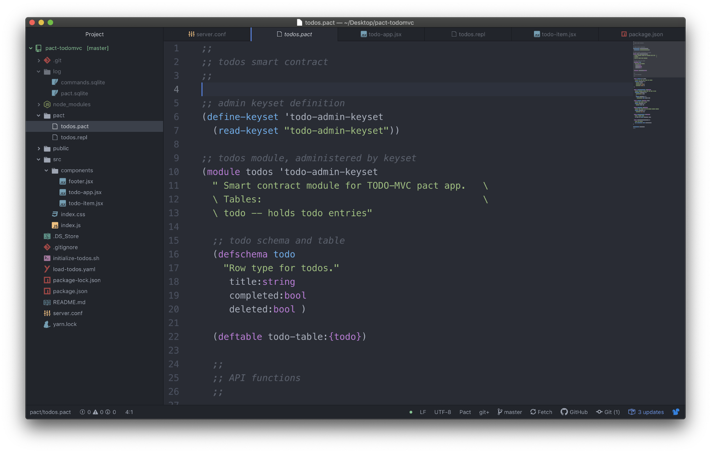
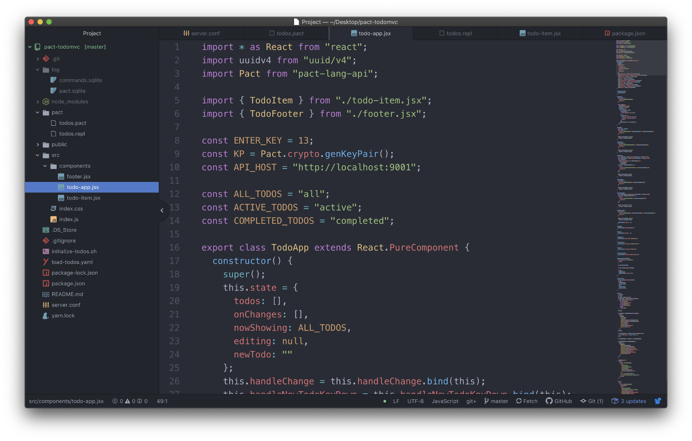

# Pact and Javascript

Welcome to this tutorial introducing Pact and Javascript! The goal of this tutorial is to help you connect your Pact development environment to a front end application.

**Topics covered in this tutorial**

* Introduction
* Install Project Dependencies
* Project Setup
* Interact with the Application
* View Project Files
* Smart Contract Code
* Javascript
* Review

!!! Summary "Key Takeaway"
      Full stack blockchain applications can be developed by pairing javascript with Pact. You can use any javascript code, library, or framework you’d like to create complex applications fully supported by Pact smart contracts attached to a blockchain base.

### Prerequisites

Having at least a basic understanding of each of the following topics will help you be successful in this tutorial.

* Programming in Javascript
* Programming in React
* Programming Pact Smart Contracts

___

## **Pact and Javascript Tutorial**

<iframe width="720" height="405" src="https://www.youtube.com/embed/s1nrWDdgM6o" frameborder="0" allow="accelerometer; autoplay; encrypted-media; gyroscope; picture-in-picture" allowfullscreen></iframe>

Subscribe to our <a href="https://www.youtube.com/channel/UCB6-MaxD2hlcGLL70ukHotA" target="_blank">YouTube channel </a> to access the latest Pact tutorials.

___

## **Introduction**

This tutorial runs through a working demonstration of a simple todo app. The app will look like this.



It allows you to organize your agenda by adding tasks with due dates that you can later update or delete if needed. You can add, complete, and clear tasks, and you can view tasks based on their status.

Like other Todo apps, it’s a great way to look at the basic functionality of the language while creating a useful app that you can use for yourself.

You can find the github page for this todo app from the Pact language GitHub page <a href="https://github.com/kadena-io/pact-todomvc" target="_blank">here</a>. If you’d like, you can try putting together the application from this documentation, and if you’d prefer, you can follow along with this tutorial where I’ll go through each step in detail.

There’s a lot going on in this tutorial. If you stick with it, it’s totally worth it. While this setup helps you get up and running with the todo app, it’s also the same setup you’ll use for many other Pact applications.

___

## **Install Project Dependencies**

Before getting started on the project, there are a few project dependencies you will need to run the application on your local computer. In this section, you’ll install each of these dependencies to get ready to run the TodoMVC locally.

**Dependencies**
* Pact
* Pact-lang-api
* TodoMVC
* Nodejs

!!! Summary "Key Takeaway"
      In the previous tutorial, you installed **Pact** and the **pact-lang-api**. These are required for this tutorial.

Note that Pact 3.0 or higher is required for this tutorial. You can check your Pact version using the following command.

``` terminal
pact -v
```

Take some time now to re-install Pact if it is a version lower than 3.0.

___

### **Install Node.js**

To create a Javascript application on your computer, you’ll need to install and run Node.js.

If you don’t already have this on your computer, you can navigate to <a href="https://nodejs.org/en/download/" target="_blank">Download | Node.js</a> to get started.



Make sure to install a node version  >= 8.11.4

You can check your version using the following command in your terminal.

``` terminal
node -v
```
___

### **Clone Project Files**

Now that you’ve installed Pact and Nodejs, you can clone the project files into a local directory.

From your terminal, navigate into the project directory where you’d like to create the application.

``` terminal
cd myProjectDirectory
```

Clone the <a href="https://github.com/kadena-io/pact-todomvc" target="_blank">Pact-todomvc</a> application.

``` terminal
git clone https://github.com/kadena-io/Pact-todomvc.git
```
Change into the todo-mvc project directory.

``` terminal
cd Pact-todomvc
```

!!! Note
      We use npm package named **pact-lang-api** to send Pact commands into the Pact server.

      This needs to be installed along with other npm packages that the app is built on. The required npm packages are saved in package.json file, and the following command installs all required npm packages "npm i"

___

## **Project Setup**

### **Create Log folder**

Pact features a full REST API HTTP server and SQLite database implementation. The Pact server simulates a single-node blockchain environment and will help you store and manipulate test data for your application.

Application data for the server is stored within a log folder.

To get started, you need to create the log folder within your project directory.

``` terminal
cd Pact-todomvc
mkdir log
```
___

## **Start the Pact Server**

Next, run the following command to start the Pact server.

``` terminal
npm run start:Pact
```



This Pact server will provide a log of each action that takes place on the application.

!!! Note
      The command, "Pact --serve server.conf" launches a Pact server.

      Everytime the server starts, we want to clear previous server's logs and create a new log directory, so we actually run the following command,

      `"rm -Rf ./log && mkdir log && Pact --serve server.conf"`

      We saved this script in package.json file <a href="https://github.com/kadena-io/pact-todomvc/blob/master/package.json" target="_blank">here</a> and can simply run the command `npm run start:Pact`

___

## **Seed the Blockchain**

Finally, open another terminal window within the same directory and run the following command to seed data into your application.

``` terminal
npm run Pact:seed
```



!!! Note
      Similar to when you ran the server, you’ll see that seeding the database calls another file, initialize-todos.sh.

      You can find **initialize-todos.sh** in the project directory. What this does is load the **todos.pact** contract by making a send request with **load-todos.yaml** files.

      Looking at load todos.yaml you can see the codefile, todo-admin-keyset, keypairs, and nonce that is loaded by **initialize-todos.sh**.


The initial seed data will include the status and response shown as a hash value.

___

## **Package.json**

Finally you can see how both `start:pact` and `pact:seed` are working by looking into the **package.json** file. Under scripts, you can see that `start:pact` is set to call the server.conf file and that `pact:seed` is set to call the **initialize-todos.sh** file.

The script to run this part is also saved in **package.json** file, so we can simply run `npm run Pact:seed`.

___

## **Start the Web Application**

After starting the Pact server and seeding the blockchain, you can now start the web application on your local server.

``` terminal
npm start
```


## **View the App**

The project is now available for you to view on your localhost! When you ran **npm start** your browser may have opened automatically to the application. If not, you can open to http://localhost:3000 to view the application now.

The todo app should currently look like this in your browser.



___

## **Interact with the Application**

Now that the app is running, try entering some Todos to get used to the functionality of the app.

In my application I’ll add the following tasks.

* Learn Pact
* Complete Pact and Javascript Tutorial

Next, I’ll complete one of the tasks I created.

* Complete Learn Pact



Feel free to add whatever todos you would like to get a better feel for the application. Coming up you’ll take a look at the project files along with the data you generated.

___

## **View Project Files**

Having a feel for how the application works, you can now view the project files. To view these files, open a new terminal within the project directory and type the following command to open the project.

``` terminal
atom .
```


### **Project Directory Overview**

Within the project folder are each of the files installed from the project repository, the dependencies installed with `npm install`, and the files you created yourself. Most of these files are specific to the front end side of this web application, but the ones unique to the Pact application are in the **log folder** and **Pact folder**.

### **View the Log Folder**

View the **log folder** you created earlier to see that it’s now filled with **sqlite** files. These files are a sort of emulated blockchain that you can use to create tables and store or retrieve data.


### **View the Pact Folder**

The Pact folder contains the **.pact** and **.repl** files that build, run, and test the smart contract. In here you’ll see **todos.pact** and **todos.repl**. The **.pact** file is the smart contract for this application, and the **.repl** file is what loads and runs tests on the Pact file.



### **View the Front End Application**

Inside of the **src** folder you will see the front end code for this application including the **components**, **html**, **jsx**, and **css** files. This is a react application, but the front end could use any library or framework you prefer.



If you’re unfamiliar with react you can visit <a href="https://reactjs.org/" target="_blank">React - A Javascript Library for Building User Interfaces</a> to get started with react applications.

___

## **Smart Contract Code**

To understand how each of the UI elements are working with the database, take some time to view the Pact smart contract. As you’ll see, there is a single todo table that you can access using a variety of functions as shown below.

### **Todo Table**

Here is the schema of the todo table.

|           |        |
|-----------|--------|
| title     | string |
| completed | bool   |
| deleted   | bool   |

### **Smart Contract Functions**

Here is a list of functions from the smart contract along with their purpose.

|                    |                                                     |
|--------------------|-----------------------------------------------------|
| new-todo           | Adds a new todo to the database.                    |
| toggle-todo-status | Changes the status of the todo within the database. |
| edit-todo          | Edits the title of the todo within the database.    |
| delete-todo        | Deletes the todo from the database.                 |
| read-todo          | Reads a single todo from the database.              |
| read-todos         | Reads all todos from the database.                  |

!!! Note
      While the code here is new, most of the functionality is covered in previous tutorials throughout the <a href="./beginner/welcome-to-pact\.html"target="_blank">Pact beginner tutorials</a>. If you have not completed these tutorials, take some time to look through them now to get a better understanding of this Pact smart contract.

As a quick refresher of what this Pact code is doing, here is a look at the code used to create the todo table and add a new todo.

### **Create Todo Schema and Table**

Here you can see a schema is defined for a table named todo that is later defined and created. This table includes rows for title, completed, and deleted.

``` clojure
;; todo schema and table
(defschema todo
  "Row type for todos."
   title:string
   completed:bool
   deleted:bool )

(deftable todo-table:{todo})

;; todo table created outside of module

```

### **New Todo**

The function new-todo adds a todo using the title input generated by the user. The application assigns the title a specific ID and uses that to generate the title as specified by the user, and an initial completed and deleted status of false.

``` clojure
(defun new-todo (id title)
  "Create new todo with ENTRY and DATE."
  (insert todo-table id {
    "title": title,
    "completed": false,
    "deleted": false })
)
```

A lot of the remaining code works similar to new-todo with slightly different functionality based on its purpose. Take some time to review each of these functions now to familiarize yourself with the application.

___

### **Javascript**

React uses the **pact-lang-api** to interact with Pact and update the database depending on the actions of the user. An understanding of the entire application takes some background in React and Javascript. For this tutorial, we’ll focus on the functionality that is specific to interacting with Pact.


To get started, navigate to **src > components > todo-app.jsx**


Within this file, you’ll see the consts, component, functions, and rendering used to connect react to Pact.

### **Imports**

First, note that aside from a few standard react imports, this file also imports Pact from the Pact-lang-api, as well as the TodoItem and TodoFooter.

``` javascript
import * as React from "react";
import uuidv4 from "uuid/v4";
import Pact from "Pact-lang-api";

import { TodoItem } from "./todo-item.jsx";
import { TodoFooter } from "./footer.jsx";
```

### **Consts**

There are also a few constants set that you’ll see used throughout the functions below including KP - which calls a specific function within the pact lang api to generate a keypair, API_HOST, and consts related to the TODO state within the database.


``` javascript
const ENTER_KEY = 13;
const KP = Pact.crypto.genKeyPair();
const API_HOST = "http://localhost:9001";

const ALL_TODOS = "all";
const ACTIVE_TODOS = "active";
const COMPLETED_TODOS = "completed";
```

Here’s a quick overview of how each of their functions are associated.

|                  |                    |                                                                  |
|------------------|--------------------|------------------------------------------------------------------|
| getTodos()       | read-todos         | Fetches all todos and returns current information from database. |
| add()            | new-todo           | Adds todo to database given title input from user.               |
| toggle()         | toggle-todo-status | Toggles single todo-status between active and complete.          |
| toggleAll()      | toggle-todo-status | Updates all todo-status between active and complete.             |
| destroy()        | delete-todo        | Updates deleted field of the todo to true.                       |
| clearCompleted() | delete-todo        | Clears completed todo’s from the database.                       |
| save(todo, text) | edit-todo          | Saves todo to the database.                                      |

One thing to note here is delete-todo, which can be a bit misleading. You can’t actually delete data from a blockchain, so rather than delete the data, it toggling the status of the delete field to true.

!!! Note
      Todo-app imports todo-item and uses some of its functionality throughout each of these functions. Take some time now to familiarize yourself with both of these files in more detail.


### **add() > new-todo demo**

Let’s look at one example in detail. In this case we can look more closely at how **add()** calls **new-todo** from todos.pact.

#### **New-todo**

This function is called by add().

``` clojure
(defun new-todo (id title)
"Create new todo with ENTRY and DATE."
(insert todo-table id {
  "title": title,
  "completed": false,
  "deleted": false })
)
```

#### **Add()**

This function is used to add a todo to the database and display it on the website for the user.

``` javascript
add(title) {
const uuid = uuidv4();
const cmdObj = {
  pactCode: Pact.lang.mkExp('todos.new-todo', uuid, title),
  keyPairs: KP
};

Pact.fetch.send(cmdObj, API_HOST)
  .then(() => this.getTodos());
}
```

Here are some details about how this function works to add and display a new todo onto the application.

|           |                                                                                                                                                                                                           |
|-----------|-----------------------------------------------------------------------------------------------------------------------------------------------------------------------------------------------------------|
| Inputs    | Add() is taking in the title as input by the user in the application.                                                                                                                                     |
| Consts    | Before sending this to pact, the function sets a const named uuid that utilizes the uuidv4 library that was imported at the top of the file.                                                              |
| cmdObj    | This is used as an object to specify information you’d like to include in the API call. Within the cmdObj we specify the pact code along with the keypairs.                                               |
| Pact Code | The pact code we use here is Pact.lang.mkExp.                                                                                                                                                             |
| mkExp     | A helper function for constructing native pact commands. In this case that’s valuable because it allows you to call a the function new-todo from todos.pact, and to specify the inputs of uuid and title. |
| Keypair   | After the pact code, you’ll see the generated keypair. This is using the constant KP, which as you’ve seen above uses Pact.crypto.genKeyPair to generate a public key.                                    |


!!! Note
      You can see more about this on the **pact-lang-api** website. It generates both a public and secret key as a string. You may recognize the public key as the hash value that was returned in the terminal earlier.

#### **Pact.fetch**

Next, you’ll see **Pact.fetch.send** which is a request to execute a command on the pact server.

In this function, pact.fetch.send includes the cmdObj built above, along with a specified **API_HOST**. This **API_HOST** is the constant set above, and is the **localhost:9001** that you saw the pact server initiate from your terminal.

Once that’s done the todo is in the database. The last step is to show this data on the website for the user.

!!! Note
      There are other pact.fetch functions including local, poll, and listen. Each of these have slightly different use cases that you can explore in the documentation.

#### **getTodos()**

That’s where this last line comes in. After sending the data to the database, this line calls **getTodos()** which is another function in this javascript file. This function is what fetches data from the database and displays it on the website.

It looks like a lot, but having seen the add function in depth, see if you can parse out what is going on in this function.

___

## **Review**

At this point you should be in a good place to continue playing around with the TodoMVC application.

Try experimenting with the look and feel of it to make it your own. Later you can try tweaking the code to see how it affects the application, and finally you can try writing your own functions that extend the functionality of this application to do whatever you’d like.

As a quick recap, you installed each of the dependencies required to create a full stack blockchain application with pact. From there, you set up the todoMVC project, investigated the project files, and then dove into the details of how pact and javascript communicating using the pact-lang-api.

After getting comfortable with this application, you’ll be in a great place to build applications of your own for entirely different use cases.
